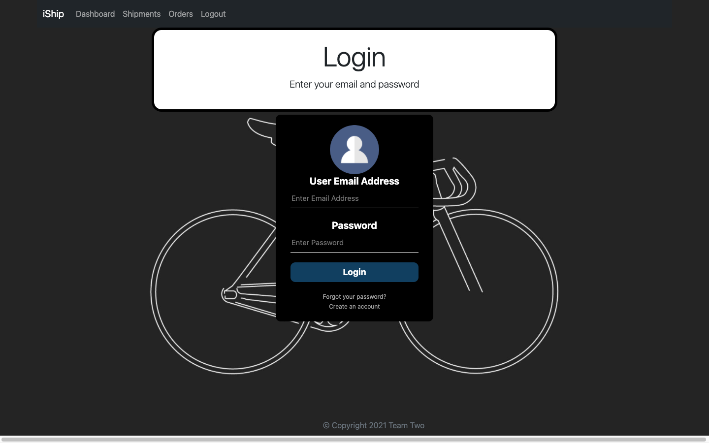
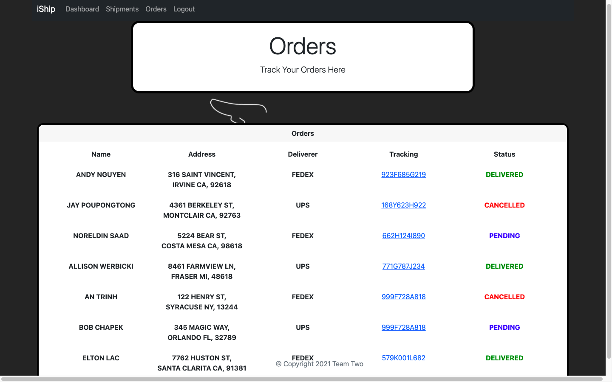
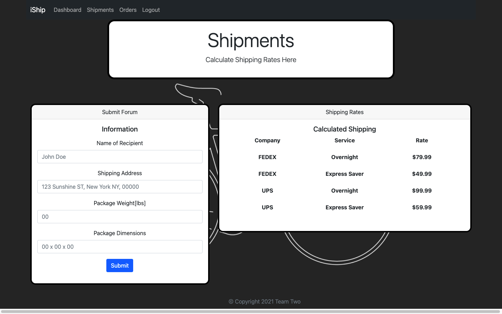

[Author](#author)
 
[Contribute](#contribute)
 
[Visualization of App Interface](#visualization-of-app-interface)
---

### About Iship

Iship is allowing you to get rates for a package you want to ship, and also to check the status of your shipments.

https://github.com/Noreldin-S/Iship

### Live Link to Deployed App

[Iship](https://we-ship.herokuapp.com/login)

### Technologies and APIs Used

- Handlebars
- NodeJS
- Bootstrap

## Visualization of App Interface

 

 

## Installation and Setup Instructions

Installation:

`npm install`  

To Start Server:

`npm start`  

---
​

## Contribute

Please submit [bugs and feature requests](https://github.com/Noreldin-S/Iship/issues)

### Author

[Noreldin Saad](https://github.com/Noreldin-S/)

